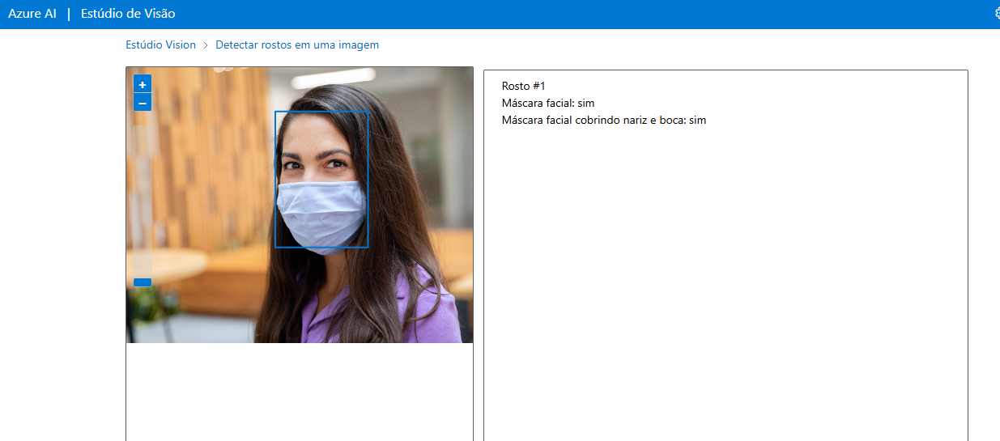
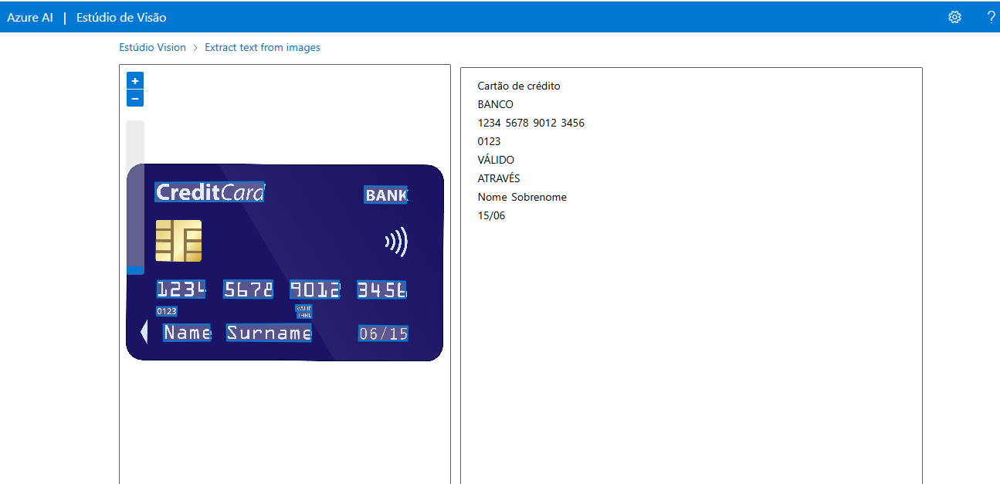

# Análise de Imagens com Azure Cognitive Services – Computer Vision

Este repositório documenta a utilização da plataforma **Azure Computer Vision** via o portal online da Microsoft:  
🔗 [https://portal.vision.cognitive.azure.com/](https://portal.vision.cognitive.azure.com/)

O objetivo é explorar os recursos de análise automática de imagens fornecidos pela API, incluindo:
- Detecção de objetos
- Leitura de texto (OCR)
- Descrição de cenas
- Classificação de imagem
- Detecção de celebridades e pontos turísticos (quando aplicável)

---

## 🔧 Tecnologias Utilizadas

- [Azure Computer Vision](https://azure.microsoft.com/en-us/services/cognitive-services/computer-vision/)
- Navegador Web (Google Chrome, Edge, etc.)

---

## 🧪 Etapas Realizadas

### 1. Acesso ao Portal

Acesse o portal de teste gratuito do Azure Computer Vision:

👉 [https://portal.vision.cognitive.azure.com/](https://portal.vision.cognitive.azure.com/)

---

### 3. Resultado da Análise

A ferramenta retorna os seguintes dados:
- Descrição em linguagem natural
- Pontuações de confiança
- Tags e categorias
- Coordenadas de objetos detectados
- Texto reconhecido (OCR)

📸 **Print dos resultados da análise:**

---

### 4. Interpretação dos Resultados

Descreva abaixo o que os resultados significam e como foram úteis na sua análise.

📝 **Análise dos resultados:**
